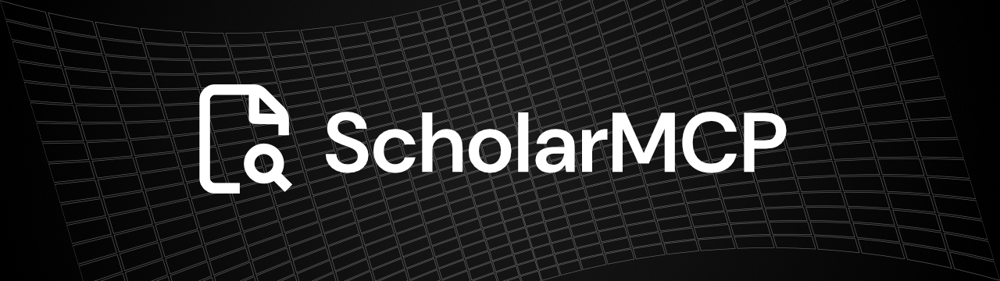

# ScholarMCP

[](https://www.npmjs.com/package/scholar-mcp)
[](https://github.com/lstudlo/ScholarMCP/commits/main)
[](https://github.com/lstudlo/ScholarMCP/blob/main/LICENSE)

ScholarMCP is an MCP server for literature research workflows in coding agents.
Official documentation: https://scholar-mcp.lstudlo.com/

It gives your agent tools to:
- search papers across multiple sources
- ingest and parse full-text PDFs
- extract structured paper details
- suggest citations and build references
- validate manuscript citations

## Who this is for

Use this if you want Claude Code, Codex, or any MCP-compatible coding agent to run research tasks directly from chat.

## What you get

- Transports: `stdio` (recommended) and HTTP (`/mcp`)
- Research providers: Google Scholar, OpenAlex, Crossref, Semantic Scholar
- Full-text parsing pipeline: `grobid -> sidecar -> simple`
- Tooling for thesis/paper workflows: ingestion, extraction, references, validation

## Quick Start

### 1. Prerequisites

- Node.js `>=20`
- `npm` (for install/publish)
- `pnpm` (for contributors working from source)

### 2. Install as an npm package (recommended)

```bash
npm install -g scholar-mcp
```

One-off run without global install:

```bash
npx -y scholar-mcp --transport=stdio
```

### 3. Run

Stdio mode:

```bash
scholar-mcp --transport=stdio
```

HTTP mode:

```bash
scholar-mcp --transport=http
```

Health check (HTTP mode):

```bash
curl http://127.0.0.1:3000/health
```

### 4. Run from source (contributors)

```bash
pnpm install
pnpm dev:stdio
```

## Use with Coding Agents

### Claude Code (recommended)

Register from globally installed binary:

```bash
claude mcp add -s user \
  -e SCHOLAR_MCP_TRANSPORT=stdio \
  -e SCHOLAR_REQUEST_DELAY_MS=350 \
  -e RESEARCH_ALLOW_REMOTE_PDFS=true \
  -e RESEARCH_ALLOW_LOCAL_PDFS=true \
  -- scholar_mcp scholar-mcp --transport=stdio
```

Register without global install:

```bash
claude mcp add -s user \
  -e SCHOLAR_MCP_TRANSPORT=stdio \
  -e SCHOLAR_REQUEST_DELAY_MS=350 \
  -e RESEARCH_ALLOW_REMOTE_PDFS=true \
  -e RESEARCH_ALLOW_LOCAL_PDFS=true \
  -- scholar_mcp npx -y scholar-mcp --transport=stdio
```

Check status:

```bash
claude mcp get scholar_mcp
```

Notes:
- Keep the `--` before `scholar_mcp` (required by current Claude CLI parsing for multiple `-e` entries).
- If you need to replace config: `claude mcp remove scholar_mcp -s project`.

### OpenAI Codex App

Add to `~/.codex/config.toml`:

```toml
[mcp_servers.scholar_mcp]
command = "npx"
args = ["-y", "scholar-mcp", "--transport=stdio"]

[mcp_servers.scholar_mcp.env]
SCHOLAR_MCP_TRANSPORT = "stdio"
SCHOLAR_REQUEST_DELAY_MS = "350"
RESEARCH_ALLOW_REMOTE_PDFS = "true"
RESEARCH_ALLOW_LOCAL_PDFS = "true"
```

### Generic MCP clients

- `stdio` command:
  - `scholar-mcp --transport=stdio`
  - Or: `npx -y scholar-mcp --transport=stdio`
- HTTP endpoint:
  1. Start server with `SCHOLAR_MCP_TRANSPORT=http scholar-mcp`
  2. Connect client to `http://127.0.0.1:3000/mcp`
  3. Optional auth: set `SCHOLAR_MCP_API_KEY` and send bearer auth header from your client

## MCP Tools

| Tool | Purpose |
|---|---|
| `search_literature_graph` | Federated search over OpenAlex/Crossref/Semantic Scholar (+ optional scholar scrape). |
| `search_google_scholar_key_words` | Keyword search on Google Scholar. |
| `search_google_scholar_advanced` | Scholar search with author/year/phrase filters. |
| `get_author_info` | Resolve author profile and top publications. |
| `ingest_paper_fulltext` | Start async full-text ingestion from DOI/URL/PDF/local path. |
| `get_ingestion_status` | Poll ingestion job status and parsed summary. |
| `extract_granular_paper_details` | Extract methods, claims, datasets, metrics, and references. |
| `suggest_contextual_citations` | Suggest citations from manuscript context. |
| `build_reference_list` | Generate formatted bibliography and BibTeX. |
| `validate_manuscript_citations` | Detect missing/uncited/duplicate citation issues. |

## Example Agent Prompts

- "Find 10 recent papers on retrieval-augmented generation and summarize methods and datasets."
- "Ingest full text for DOI `10.1038/s41467-024-55563-6`, then extract claims and limitations."
- "Given this draft section, suggest citations in IEEE style and generate BibTeX."
- "Validate my manuscript citations against this reference list and show missing citations."

## Optional Python Sidecar (better parsing fallback)

Run sidecar:

```bash
cd ../../services/python-sidecar
python -m venv .venv
source .venv/bin/activate
pip install -r requirements.txt
uvicorn app:app --host 127.0.0.1 --port 8090
```

Then set:

```bash
RESEARCH_PYTHON_SIDECAR_URL=http://127.0.0.1:8090
```

## Configuration

Most users only need these:

- `SCHOLAR_MCP_TRANSPORT`: `stdio` | `http` | `both` (default: `stdio`)
- `SCHOLAR_REQUEST_DELAY_MS`: request pacing to reduce rate-limit risk (default: `250`)
- `RESEARCH_ALLOW_REMOTE_PDFS`: allow remote PDF downloads for ingestion (default: `true`)
- `RESEARCH_ALLOW_LOCAL_PDFS`: allow local PDF ingestion (default: `true`)
- `SCHOLAR_MCP_API_KEY`: optional bearer token for HTTP mode
- `RESEARCH_GROBID_URL`: optional GROBID endpoint
- `RESEARCH_PYTHON_SIDECAR_URL`: optional sidecar endpoint

The CLI loads `.env` from the current working directory automatically at startup.

Advanced options exist in `src/config.ts` for timeouts, retries, HTTP session capacity/TTL, provider tuning, and cache behavior.

## Troubleshooting

- `Invalid environment variable format` in `claude mcp add`:
  - Add `--` before the MCP server name (see Claude setup command above).
- `Unable to resolve a downloadable PDF URL from input` on DOI ingestion:
  - The DOI landing page may not expose a downloadable PDF.
  - Retry with `pdf_url` (direct PDF) or `local_pdf_path`.
- Too many Scholar failures or throttling:
  - Increase `SCHOLAR_REQUEST_DELAY_MS` (for example `500` to `1000`).

## Dev Verification

```bash
pnpm check
pnpm test
```

## Documentation Site (Astro)

The repository includes an integrated Astro + Starlight docs app at `apps/docs` (repo-root path).

```bash
# run docs locally
pnpm docs:dev

# regenerate generated docs artifacts only
pnpm docs:sync

# verify docs
pnpm docs:check

# build docs output to apps/docs/dist
pnpm docs:build
```

Generated docs artifacts:
- MCP tool reference: `apps/docs/src/content/docs/reference/mcp-tools.mdx`
- Release notes index: `apps/docs/src/content/docs/releases/index.mdx`

Generation source inputs:
- Tool metadata: `packages/scholar-mcp/src/mcp/create-scholar-mcp-server.ts`
- Release metadata: git tags in this repository

Cloudflare Pages target settings:
- Root directory: `/`
- Build command: `pnpm install --frozen-lockfile && pnpm docs:build`
- Build output directory: `apps/docs/dist`
- Production branch: `main`
- Canonical docs URL: `https://scholar-mcp.lstudlo.com/`

Automatic deployment is configured via Cloudflare Pages Git integration:
- Cloudflare dashboard path: `Workers & Pages` -> your project -> `Settings` -> `Builds` -> `Git repository`
- Ensure repo access is granted in the Cloudflare GitHub app installation
- Configure branch controls in `Settings` -> `Builds` -> `Branch control`
  - Production branch: `main`
  - Preview branches: `All non-production branches` (or custom include/exclude)
- Build skip flags in commit message disable auto deploy (`[CI Skip]`, `[CI-Skip]`, `[Skip CI]`, `[Skip-CI]`, `[CF-Pages-Skip]`)

## Publish Workflow

```bash
# 1) update version
npm version patch

# 2) verify source quality
pnpm check
pnpm test

# 3) verify npm package contents and executable bin
npm run pack:dry-run
npm pack

# 4) publish to npm
npm publish
```

Post-publish smoke test:

```bash
npx -y scholar-mcp --version
npx -y scholar-mcp --help
```

## Usage Notes

Google Scholar may throttle automated traffic. Use conservative request pacing, respect provider terms, and avoid abusive query patterns.
